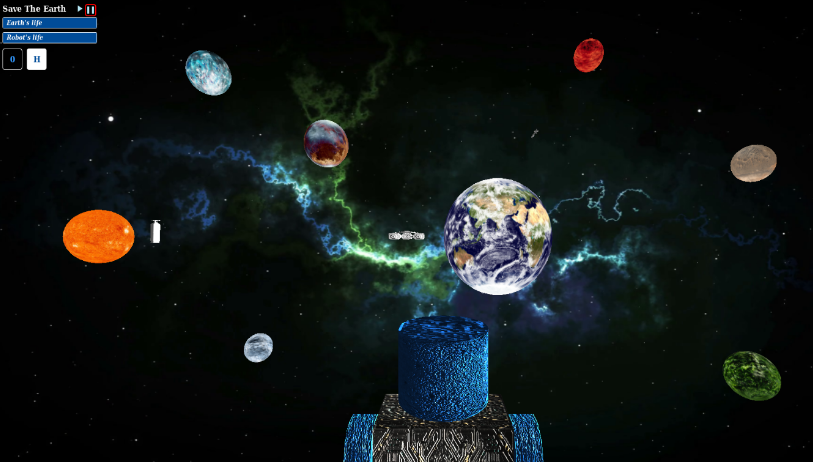

# Interactive Graphics Project
You can see and test the game at the following link: https://leonardouniromasalvucci.github.io/Interactive_Graphics_3D_Game/  
For more details on implementation and functionality, you can view the [report.](https://drive.google.com/file/d/1b8VNvJ2JJkKqKHxEA6L-tQWlVu3dPF46/view?usp=sharing) 

# Interface

